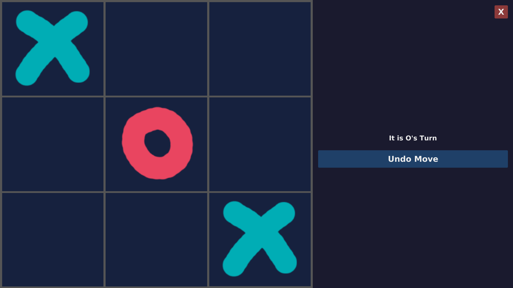
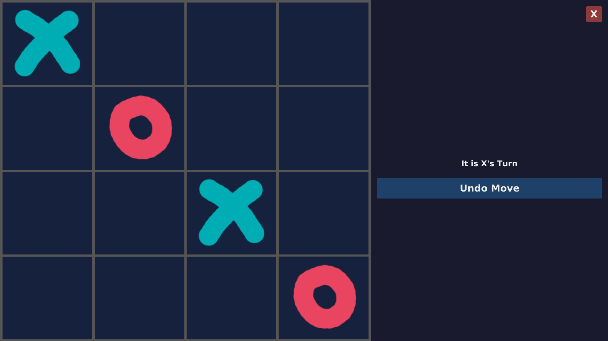

# TicTacToe Minimax

## Table of Contents
1. [Project Overview](#project-overview)
2. [Features](#features)
3. [Getting Started](#getting-started)
    - [How to Run](#how-to-run)
    - [How to Build](#how-to-build)
4. [Technical Breakdown](#technical-breakdown)
    - [Project Architecture](#project-architecture)
    - [In-depth Minimax Explanation](#in-depth-minimax-explanation)
5. [What's Next](#whats-next)

## Project Overview
A TicTacToe project developed as a Java-based addition to my programming portfolio.  
The main focus of the project was to implement an optimized Minimax algorithm for TicTacToe, and architect the surrounding game environment to clearly showcase it.

The project places strong emphasis on clean object-oriented design, clear separation of responsibilities, and maintainable architecture, serving as a deliberate improvement over my earlier Neural Network from-scratch project in python, which suffered from poor structure and scalability issues.

This project was also submitted as my ICS3U and ICS4U RST final assignments, but it was primarily developed as a personal learning project, with the course requirements aligning naturally with the goals I had already set for myself.


## Features
- Support for both 3x3 and 4x4 boards.
- Unbeatable Minimax AI.  
- Simple AI (random moves) and local multiplayer supported.
- Minimax permanent memory caching.
- Three printing modes. [See below](#printing-samples).
- Modular and easily scalable OOP-friendly design.
- Extensive JUnit test coverage following TDD guidelines.
- Gradle build system
- Standalone application packages generated using jpackage and github actions are avalilable for Windows, Linux, and macOS.


### Printing Samples
- Simple Printing:
```
  X  2  3     O  2  3  4  
  4  O  6     5  X  7  8 
  7  8  X     9 10  O 12 
             13 14 15  X 
```
- Box-drawing character printing:
```
┌───┬───┬───┐    ┌───┬───┬───┬───┐
│ X │   │   │    │ O │   │   │   │
├───┼───┼───┤    ├───┼───┼───┼───┤
│   │ O │   │    │   │ X │   │   │
├───┼───┼───┤    ├───┼───┼───┼───┤
│   │   │ X │    │   │   │ O │   │
└───┴───┴───┘    ├───┼───┼───┼───┤
                 │   │   │   │ X │
                 └───┴───┴───┴───┘
```
- JavaFX (graphical)  
3x3

4x4  


## Getting Started

### How to Run
Prebuilt application packages are avalilable from the 
[Github Releases](https://github.com/Denomant/TicTacToeMinimax/releases).  
No Java, git, or any other tools are required to run those.

#### Linux
1. Download the latest release ZIP file from the releases page.
2. Extract the archive.
3. Open the terminal and navigate to the `bin` directory:
``` bash
cd TicTacToe/bin
```
4. Make the launcher executable:
``` bash
chmod +x TicTacToe
```
5. Run the application:
``` bash
./TicTacToe
```

#### Windows 
1. Download the latest release ZIP file from the releases page.
2. Extract the archive.
3. Open the extracted folder and double-click the application (TicTacToe.exe)

**If SmartScreen displays a security warning,: Click More Info -> Run Anyway**

#### MacOS
1. Download the latest release ZIP file from the Releases page.
2. Extract the archive.
3. Open a terminal and navigate to the directory containing TicTacToe.app
4. Make the launcher executable:
``` bash
chmod +x TicTacToe.app/Contents/MacOS/TicTacToe
```
5. Run the application:
``` bash
./TicTacToe.app/Contents/MacOS/TicTacToe
```

---

### How to Build
You will need [Java version 21](https://www.oracle.com/ca-en/java/technologies/downloads/#java21) and [Git](https://git-scm.com/install/) installed on your system.

- To check your Java version:
```bash
java --version
```
- To check whether Git is installed:
```bash
git
```

1. In your terminal, navigate to the directory where you want the repository to be cloned.
2. Clone the repository and enter the project directory:
```bash
git clone https://github.com/Denomant/TicTacToeMinimax.git

# Windows
cd TicTacToeMinimax\Zaltsberg_ICS3U_RST

# Linux / macOS
cd TicTacToeMinimax/Zaltsberg_ICS3U_RST
```

3. To run the project directly from source:
```bash
# Use .\gradlew.bat on Windows 
./gradlew run
```

4. To run JUnit tests:
```bash
# Use .\gradlew.bat on Windows 
./gradlew test
# Note, Player JUnit tests are expected to take up to a minute due to Minimax depth.
```
Test reports can be found in `build/reports/tests/test/index.html`

5. To build the project:
```bash
# Use .\gradlew.bat on Windows 
./gradlew build
```
After building, the JAR file can be found in `build/libs/Zaltsberg_ICS3U_RST-1.0.jar`  
Run it using:
```bash
# Accepts forward slashes everywhere
java -jar build/libs/Zaltsberg_ICS3U_RST-1.0.jar
```

## Technical Breakdown
### Project Architecture
```
src/
├── main/
│   └── App.java
└── TicTacToe/
    ├── JavaFX/
    │   ├── JavaFXApp.java
    │   ├── JavaFXPlayer.java
    │   └── JavaFXPrinter.java
    ├── board/
    │   ├── Board3x3.java
    │   ├── Board4x4.java
    │   └── TicTacToeBoard.java
    ├── boardprinter/
    │   ├── BoardPrinter.java
    │   ├── BoxCharacterPrinter.java
    │   └── SimplePrinter.java
    ├── input/
    │   ├── ConsoleIntInputReader.java
    │   ├── IntInputReader.java
    │   └── MockIntInputReader.java
    ├── model/
    │   ├── Cell.java
    │   └── CellValue.java
    ├── player/
    │   ├── Minimax.java
    │   ├── PersistentMinimax.java
    │   ├── PlayerAction.java
    │   ├── Random.java
    │   ├── TicTacToePlayer.java
    │   └── User.java
    └── test/
        ├── _JUnit_BoardPrinters.java
        ├── _JUnit_Boards.java
        ├── _JUnit_Cells.java
        └── _JUnit_Players
```

| Name | Type | Relationships | Description |
|------|------|---------------|-------------|
| JavaFX.JavaFXApp | class | Uses JavaFXPlayer and JavaFXPrinter | JavaFX application entry point that builds and launches the graphical UI. |
| JavaFX.JavaFXPlayer | class | Implements TicTacToePlayer | JavaFX-based player/controller that accepts moves from the graphical interface and passes them into the main thread. |
| JavaFX.JavaFXPrinter | class | Implements BoardPrinter | JavaFX renderer used to update the board in the graphical interface. |
| model.CellValue | enum | None | Represents a cell's state: X, O, or EMPTY. |
| model.Cell | class | Uses CellValue | Immutable value object with row, column, and CellValue fields. |
| board.TicTacToeBoard<T extends TicTacToeBoard<T>> | abstract class | Uses Cell | Abstract base class (CRTP) providing an immutable 2-dimensional cell array with defensive copying mechanism on look-up, and safe move result and symmetry. |
| board.Board3x3 | final class | Extends TicTacToeBoard | Concrete 3x3 board implementation specifying board size and win conditions for 3x3 play. |
| board.Board4x4 | final class | Extends TicTacToeBoard | Concrete 4x4 board implementation specifying board size and win conditions for 4x4 play. |
| player.TicTacToePlayer | interface | Uses TicTacToeBoard and Cell | Interface representing a player that selects a Cell given a TicTacToeBoard state. |
| player.Random | class | Implements TicTacToePlayer | Player implementation that returns a random valid move from the current board. |
| player.User | class | Implements TicTacToePlayer, uses IntInputReader | Console-based player that prompts for row and column via an injected IntInputReader |
| player.Minimax | class | Implements TicTacToePlayer | Search-based AI that recursively evaluates the game tree (Minimax), supporting optimized memorization to choose the optimal move. [See In-depth Minimax Explanation](#in-depth-minimax-explanation) |
| player.PersistentMinimax | class | Extends Minimax | Minimax variant that stores the cached evaluations for reuse across games. |
| input.IntInputReader | interface | None | Interface for reading integer input (abstracts input source for testing). |
| input.ConsoleIntInputReader | class | Implements IntInputReader | Console implementation using the simpleIO library to read integers |
| input.MockIntInputReader | class | Implements IntInputReader | Test implementation that returns a predetermined sequence of integers supplied at construction (for automated tests). |
| boardprinter.BoardPrinter | interface | None | Provides an Interface defining a method to render/format a TicTacToeBoard for output. |
| boardprinter.SimplePrinter | class | Implements BoardPrinter | Plain-text printer that outputs a compact numeric/cell view. [See Sample Above](#printing-samples) |
| boardprinter.BoxCharacterPrinter | class | Implements BoardPrinter | Printer that renders the board using box-drawing characters for a framed output. [See Sample Above](#printing-samples) |

### In-depth Minimax Explanation
The Minimax algorithm explores all possible future game states using recursion. For each possible move on the board, the algorithm simulates the resulting board, and then recursively calls itself on the result until a terminal state is reached (win, loss, or draw). The recursion then “bubbles up” the final score for each move, allowing the AI to choose the option that guarantees the best possible outcome assuming most optimal play from the opponent.  

To improve performance, the AI uses aggressive memoization through compact board encoding in a hashtable. Instead of storing up to three integers per cell across as many as sixteen cells per board, each board is compressed into a single 32-bit integer using two bits per cell. Each Cell is mapped to a fixed binary number that represents one of the three possible states a Cell can have (`00` for `EMPTY`, `01` for `X`, and `10` for `O`). The board is then encoded by iterating through all cells and left-shifting the integer by two bits before inserting the current cell’s value.

This allows an entire 4x4 board to fit inside one integer value resulting in roughly a **48:1** memory optimization. In addition, board symmetries are exploited using `getAllSymmetryCellMappings`, meaning all reflected versions of the same position all stored at the same time, increasing speed by up to **four times**.

And finally, the algorithm uses alpha–beta pruning to eliminate branches of the game tree that cannot influence the final decision. By tracking the best guaranteed outcomes for both players, the AI can stop evaluating moves once they are proven to be worse than an already known alternative. This significantly reduces the number of recursive calls while preserving perfect-play accuracy. According to Wikipedia, in worst case scenario this does not affect search at all, and in best case scenario it **square-roots** the amount of explored branches.

## What's Next
This project is currently considered feature-complete.